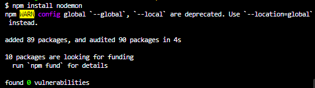
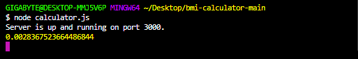
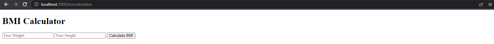

# bmi-calculator
nodejs express bmi calculator (console.logging result)

you need node_modules in same path to see result.

1)go to terminal:  
2)cd foldersfilepath   
3)command:(npm install express)    

  

4)command:node calculator.js    

  

5)go to chrome    

  

6)go to localhost:3000/bmicalculator
